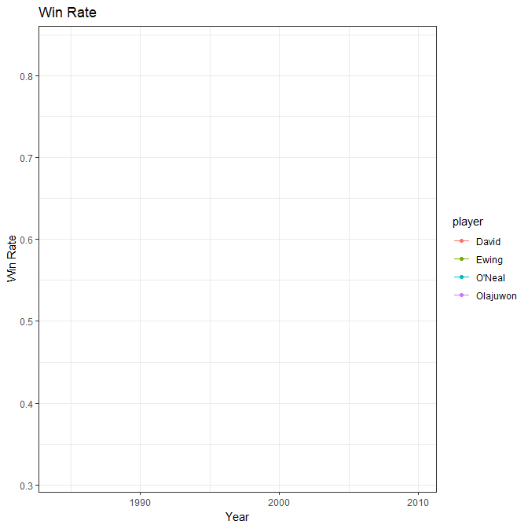

```{r setup, include=FALSE}
knitr::opts_chunk$set(fig.width=7, fig.height=7)
library(MASS)
library(plyr)
library(tidyverse)
library(ggpubr)
library(ggplot2)
library(leaflet)
library(plotly)
library(flexdashboard)
library(knitr)
library(dplyr)
library(gapminder)
library(kableExtra)
library(lubridate)
library(gganimate)
library(patchwork)
library(readxl)
library(fmsb)
library(gridExtra)
David_RE <- read_excel("C:/Users/srspp/Documents/R/DAV_期末報告_A1103340/DAV_期末報告_A1103340.xlsx", sheet = "David", 
                     range = "A18:S32")
David_PO <- read_excel("C:/Users/srspp/Documents/R/DAV_期末報告_A1103340/DAV_期末報告_A1103340.xlsx", sheet = "David", range = "A2:T14")
Oneal_RE <- read_excel("C:/Users/srspp/Documents/R/DAV_期末報告_A1103340/DAV_期末報告_A1103340.xlsx", sheet = "Oneal", 
                       range = "A2:T22")
Oneal_PO <- read_excel("C:/Users/srspp/Documents/R/DAV_期末報告_A1103340/DAV_期末報告_A1103340.xlsx", sheet = "Oneal", 
                       range = "A27:T44")
Ewing_RE <- read_excel("C:/Users/srspp/Documents/R/DAV_期末報告_A1103340/DAV_期末報告_A1103340.xlsx", sheet = " Ewing", 
                       range = "A2:T19")
Ewing_PO <- read_excel("C:/Users/srspp/Documents/R/DAV_期末報告_A1103340/DAV_期末報告_A1103340.xlsx", sheet = " Ewing", 
                       range = "A22:T36")
Oljauwon_RE <- read_excel("C:/Users/srspp/Documents/R/DAV_期末報告_A1103340/DAV_期末報告_A1103340.xlsx", sheet = "Oljauwon", 
                       range = "A2:T20")
Oljauwon_PO <- read_excel("C:/Users/srspp/Documents/R/DAV_期末報告_A1103340/DAV_期末報告_A1103340.xlsx", sheet = "Oljauwon", 
                       range = "A24:T39")

RAZARD_CP<- read_excel("C:/Users/srspp/Documents/R/DAV_期末報告_A1103340/DAV_期末報告_A1103340.xlsx", sheet = "RADAR data", 
                     range = "L1:O7")
basketball_data <- read_excel("C:/Users/srspp/Documents/R/DAV_期末報告_A1103340/DAV_期末報告_A1103340.xlsx", 
                              sheet = "win Rate")
rownames(RAZARD_CP) <- c("max","min","OL","E","O","D")
```


David Robinson{data-icon="fa-table"}
======================================================================


Column {.tabset .tabset-fade}
------------------
### Regular Seanson Attack

```{r}
DR1 <- David_RE %>% ggplot( aes(x=SEASON,y=PTS,fill=PTS))+
  geom_bar(stat='identity')+
  theme_minimal()+
  ggtitle("David Robinson Regular Season PTS(avg)")+
  geom_text( aes(label=PTS), vjust=-0.15)+
  scale_fill_gradient(low="#D0D0D0",high = "#5B5B5B")

DR2 <- David_RE %>%
  ggplot(aes(x = SEASON, y = TS)) + 
  geom_line(linetype = 1,size=0.3) + 
  geom_point(shape = 20, size = 3, fill = "white")+
  ggtitle("David Robinson RegularSeason TS")+
  theme_bw()
DR1/DR2
```

### Regular Seanson Defense
```{r}

DR3 <- David_RE %>% ggplot( aes(x=SEASON,y=REB-mean(x=REB),fill=REB))+
  geom_bar(stat='identity')+
  theme_minimal()+
  labs(y="RBE")+
  ggtitle("David Robinson Regular Season REB(avg)")+
  geom_hline(size=1,yintercept =0)+
  scale_fill_gradient(low="#D0D0D0",high = "#5B5B5B")
DR4 <- David_RE %>%
  ggplot(aes(x = SEASON, y = BLK,fill=BLK)) + 
  geom_bar(stat='identity',alpha=0.5)+
  geom_line(linetype = 1,size=0.5) + 
  geom_point(shape = 20, size = 3, fill = "white")+
  ggtitle("David Robinson RegularSeason BLK")+
  scale_fill_gradient(low="#D0D0D0",high = "#5B5B5B")
  theme_bw()
  
DR3/DR4

```


Column {.tabset .tabset-fade}
----------------------
### Post Season Attack
```{r}
DP1 <- David_PO %>% 
  ggplot( aes(x=SEASON,y=PTS,fill=PTS))+
  geom_bar(stat='identity')+
  theme_minimal()+
  ggtitle("David Robinson PostSeason PTS(avg)")+
  geom_text( aes(label=PTS), vjust=-0.15)+
  scale_fill_gradient(low="#D0D0D0",high = "#5B5B5B")
DP2 <- David_PO %>% 
  ggplot(aes(x = SEASON, y = TS)) + 
  geom_line(linetype = 1,size=0.5) + 
  geom_point(shape = 20, size = 3, fill = "white")+
  ggtitle("David Robinson POSTSeason TS")+
  theme_bw()
DP1/DP2
```

### Post Season Defense
```{r}
DP4 <- David_PO %>% 
  ggplot(aes(x = SEASON, y = BLK,fill=BLK)) +
  geom_bar(stat='identity',alpha=0.5)+
  geom_line(linetype = 1,size=0.5) + 
  geom_point(shape = 20, size = 3, fill = "white")+
  ggtitle("David Robinson POSTSeason BLK")+
  scale_fill_gradient(low="#D0D0D0",high = "#5B5B5B")
  theme_bw()
DP3 <- David_PO %>% ggplot( aes(x=SEASON,y=REB-mean(x=REB),fill=REB))+
  geom_bar(stat='identity')+
  theme_minimal()+
  labs(y="RBE")+
  ggtitle("David Robinson  POSTSeason REB(avg)")+
  geom_hline(size=1,yintercept =0)+
  scale_fill_gradient(low="#D0D0D0",high = "#5B5B5B")

DP3/DP4

```

Patrick Ewing {data-icon="fa_table}
======================================================================


Column {.tabset .tabset-fade}
------------------

### Regular Seanson Attack

```{r}
ER1 <- Ewing_RE %>% ggplot( aes(x=SEASON,y=PTS,fill=PTS))+
  geom_bar(stat='identity')+
  theme_minimal()+
  ggtitle("Patrick Ewing Regular Season PTS(avg)")+
  geom_text( aes(label=PTS), vjust=-0.15)+
  scale_fill_gradient(low="#ACD6FF",high = "#0072E3")
ER2 <- Ewing_RE %>%
  ggplot(aes(x = SEASON, y = TS,fill=TS)) + 
  
  geom_line(linetype = 1,size=1,color="#ACD6FF") + 
  geom_point(shape = 21, size = 1.5, fill = "#0072E3")+
  ggtitle("Patrick Ewing RegularSeason TS")+
  theme_bw()+
  scale_fill_gradient(low="#ACD6FF",high = "#0072E3")

grid.arrange(ER1,ER2,nrow=2)
```

### Regular Seanson Defense
```{r}
ER3 <- Ewing_RE %>% ggplot( aes(x=SEASON,y=REB-mean(x=REB),fill=REB))+
  geom_bar(stat='identity')+
  theme_minimal()+
  labs(y="RBE")+
  ggtitle("Patrick Ewing Regular Season REB(avg)")+
  geom_hline(size=1,yintercept =0)+
  scale_fill_gradient(low="#ACD6FF",high = "#0072E3")
ER4 <- Ewing_RE %>%
  ggplot(aes(x = SEASON, y = BLK,fill=BLK)) +
  geom_bar(stat='identity',alpha=0.5)+
  geom_line(linetype = 1,size=1,color="#84C1FF") + 
  geom_point(shape = 21, size = 1.5, fill = "#0072E3")+
  ggtitle("Patrick Ewing RegularSeason BLK")+
  theme_bw()+
  scale_fill_gradient(low="#ACD6FF",high = "#0072E3")
ER3/ER4
```


Column {.tabset .tabset-fade}
----------------------

### Post Season Attack
```{r}
EP1 <- Ewing_PO %>% 
  ggplot( aes(x=SEASON,y=PTS,fill=PTS))+
  geom_bar(stat='identity')+
  theme_minimal()+
  ggtitle("Patrick Ewing PostSeason PTS(avg)")+
  geom_text( aes(label=PTS), vjust=-0.15)+
  scale_fill_gradient(low="#ACD6FF",high = "#0072E3")
EP2 <- Ewing_PO %>% 
  ggplot(aes(x = SEASON, y = TS)) + 
  geom_line(linetype = 1,size=1,color="#84C1FF") + 
  geom_point(shape = 21, size = 1.5, fill = "#0072E3")+
  ggtitle("Patrick Ewing POSTSeason TS")+
  theme_bw()
EP1/EP2
  
```

### Post Season Defense
```{r}
EP4 <- Ewing_PO %>% 
  ggplot(aes(x = SEASON, y = BLK)) + 
  geom_line(linetype = 1,size=1,color="#84C1FF") + 
  geom_point(shape = 21, size = 3, fill = "#0072E3")+
  ggtitle("Patrick Ewing POSTSeason BLK")+
  theme_bw()
EP3 <- Ewing_PO %>% 
  ggplot(aes(x = SEASON, y = BLK,fill=BLK)) +
  geom_bar(stat='identity',alpha=0.5)+
  geom_line(linetype = 1,size=1,color="#84C1FF") + 
  geom_point(shape = 21, size = 1.5, fill = "#0072E3")+
  ggtitle("Patrick Ewing POSTSeason BLK")+
  theme_bw()
EP3/EP4
```


Oljauwon{data-icon="fa-table"}
======================================================================


Column {.tabset .tabset-fade}
------------------
### Regular Seanson Attack

```{r}
OL1 <- Oljauwon_RE %>% ggplot( aes(x=SEASON,y=PTS,fill=PTS))+
  geom_bar(stat='identity')+
  theme_minimal()+
  ggtitle("Oljauwon Regular Season PTS(avg)")+
  geom_text( aes(label=PTS), vjust=-0.15,size=2.5)+
  scale_fill_gradient(low="#FFD2D2",high = "#FF0000")
OL2 <- Oljauwon_RE %>%
  ggplot(aes(x = SEASON, y = TS)) + 
  geom_line(linetype = 1,size=1,color="#FFD2D2") + 
  geom_point(shape = 21, size = 1.5, fill =  "#FF0000")+
  ggtitle("Oljauwon RegularSeason TS")+
  theme_bw()


OL1/OL2
```

### Regular Seanson Defense
```{r}
OL3 <- Oljauwon_RE %>% ggplot( aes(x=SEASON,y=REB-mean(x=REB),fill=REB))+
  geom_bar(stat='identity')+
  theme_minimal()+
  labs(y="RBE")+
  ggtitle("Oljauwon Regular Season REB(avg)")+
  geom_hline(size=1,yintercept =0)+
  scale_fill_gradient(low="#FFD2D2",high = "#FF0000")
OL4 <- Oljauwon_RE %>%
  ggplot(aes(x = SEASON, y = BLK,fill=BLK)) + 
  geom_bar(stat='identity',alpha=0.5)+
  geom_line(linetype = 1,size=1,color="#FFD2D2") + 
  geom_point(shape = 21, size = 1.5, fill =  "#FF0000")+
  ggtitle("Oljauwon RegularSeason BLK")+
  scale_fill_gradient(low="#FFD2D2",high = "#FF0000")+
  theme_bw()
OL3/OL4
```


Column {.tabset .tabset-fade}
----------------------
### Post Season Attack
```{r}
OLP1 <- Oljauwon_PO %>% 
  ggplot( aes(x=SEASON,y=PTS,fill=PTS))+
  geom_bar(stat='identity')+
  theme_minimal()+
  ggtitle("Oljauwon PostSeason PTS(avg)")+
  geom_text( aes(label=PTS), vjust=-0.15)+
  scale_fill_gradient(low="#FFD2D2",high = "#FF0000")
OLP2 <- Oljauwon_PO %>% 
  ggplot(aes(x = SEASON, y = TS)) + 
  geom_line(linetype = 1,size=1,color="#FFD2D2") + 
  geom_point(shape = 21, size = 1.5, fill =  "#FF0000")+
  ggtitle("Oljauwon POSTSeason TS")+
  theme_bw()
OLP1/OLP2
```

### Post Season Defense
```{r}
OLP4 <- Oljauwon_PO %>% 
  ggplot(aes(x = SEASON, y = BLK,fill=BLK)) + 
  geom_bar(stat='identity',alpha=0.5)+
  geom_line(linetype = 1,size=1,color="#FFD2D2") + 
  geom_point(shape = 21, size = 1.5, fill =  "#FF0000")+
  ggtitle("Oljauwonn POSTSeason BLK")+
  scale_fill_gradient(low="#FFD2D2",high = "#FF0000")+
  theme_bw()
OLP3 <- Oljauwon_PO %>% ggplot( aes(x=SEASON,y=REB-mean(x=REB),fill=REB))+
  geom_bar(stat='identity')+
  theme_minimal()+
  labs(y="RBE")+
  ggtitle("Oljauwon  POSTSeason REB(avg)")+
  geom_hline(size=1,yintercept =0)+
  scale_fill_gradient(low="#FFD2D2",high = "#FF0000")
OLP3/OLP4
```


Shaq O'Neal{data-icon="fa-table"}
======================================================================


Column {.tabset .tabset-fade}
------------------
### Regular Seanson Attack

```{r}
OR1 <- Oneal_RE %>% ggplot( aes(x=season,y=PTS,fill=PTS))+
  geom_bar(stat='identity')+
  theme_minimal()+
  ggtitle("Shaq O'Neal Regular Season PTS(avg)")+
  geom_text( aes(label=PTS), vjust=-0.15,size=2.5)+
  scale_fill_gradient(low="#FFF0AC",high = "#C6A300")

OR2 <- Oneal_RE %>%
  ggplot(aes(x=season, y = TS)) + 
  geom_line(linetype = 1,size=1,color="#FFF0AC") + 
  geom_point(shape = 21, size = 1.5, fill =  "#C6A300")+
  ggtitle("Shaq O'Neal RegularSeason TS")+
  theme_bw()

OR1/OR2
```

### Regular Seanson Defense
```{r}
OR3 <- Oneal_RE %>% ggplot( aes(x=season,y=REB-mean(x=REB),fill=REB))+
  geom_bar(stat='identity')+
  theme_minimal()+
  labs(y="RBE")+
  ggtitle("Shaq O'Neal Regular Season REB(avg)")+
  geom_hline(size=1,yintercept =0)+
  scale_fill_gradient(low="#FFF0AC",high = "#C6A300")
OR4 <- Oneal_RE %>%
  ggplot(aes(x=season, y = BLK,fill=BLK)) + 
  geom_bar(stat='identity',alpha=0.5)+
  geom_line(linetype = 1,size=1,color="#FFF0AC")  + 
  geom_point(shape = 21, size = 1.5, fill =  "#C6A300")+
  ggtitle("Shaq O'Neal RegularSeason BLK")+
  scale_fill_gradient(low="#FFF0AC",high = "#C6A300")+
  theme_bw()
OR3/OR4
```


Column {.tabset .tabset-fade}
----------------------
### Post Season Attack
```{r}
OP1 <- Oneal_PO %>% ggplot( aes(x=SEASON,y=PTS,fill=PTS))+
  geom_bar(stat='identity')+
  theme_minimal()+
  ggtitle("Shaq O'Neal POSTSeason PTS(avg)")+
  geom_text( aes(label=PTS), vjust=-0.15,size=2.5)+
  scale_fill_gradient(low="#FFF0AC",high = "#C6A300")

OP2 <- Oneal_PO%>%
  ggplot(aes(x=SEASON, y = TS)) + 
  geom_line(linetype = 1,size=1,color="#FFF0AC")  + 
  geom_point(shape = 21, size = 1.5, fill =  "#C6A300")+
  ggtitle("Shaq O'Neal POSTSeason  TS")+
  theme_bw()

OP1/OP2
  
```

### Post Season Defense
```{r}
OP3 <- Oneal_PO %>% ggplot( aes(x=SEASON,y=REB-mean(x=REB),fill=REB))+
  geom_bar(stat='identity')+
  theme_minimal()+
  labs(y="RBE")+
  ggtitle("Shaq O'Neal POSTSeason  REB(avg)")+
  geom_hline(size=1,yintercept =0)+
  scale_fill_gradient(low="#FFF0AC",high = "#C6A300")
OP4 <- Oneal_PO %>%
  ggplot(aes(x=SEASON, y = BLK,fill=BLK)) +
  geom_bar(stat='identity',alpha=0.5)+
  geom_line(linetype = 1,size=1,color="#FFF0AC")  + 
  geom_point(shape = 21, size = 1.5, fill =  "#C6A300")+
  ggtitle("Shaq O'Neal POSTSeason  BLK")+
  scale_fill_gradient(low="#FFF0AC",high = "#C6A300")
  theme_bw()
OP3/OP4
```

Compare
=====================================================================


## Column 1

### Razar
```{r}
colors_border <- c(rgb(0.8,0.2,0.5,0.7),rgb(0.2,0.4,0.9,0.7),rgb(0.7,0.5,0.1,0.7),rgb(0,0,0.1,0.7))
colors_fill <- c(rgb(0.8,0.2,0.5,0.2),rgb(0.2,0.4,0.9,0.2),rgb(0.7,0.5,0.1,0.2),rgb(0,0,0.1,0))
radarchart(RAZARD_CP, axistype = 1,title = "Compare DATA ",
           pcol=colors_border,pfcol=colors_fill,plwd=4,plty = 1,
           cglcol = "grey",cglty = 1,axislabcol = "grey",caxislabels = c(-2,-1,0,1,2),cglwd = 0.8,
           vlcex=0.9)

```

## Column 2
### Win Rate
```{r}
WR1 <- ggplot(data = basketball_data,
       mapping = aes(x = year, y = win_rate,color=player))+
  geom_line()+
  geom_point(aes(group=seq_along(year)))+
  labs(x="Year",
       y="Win Rate")+
  theme_bw()+
  ggtitle("Win Rate")+
  transition_reveal(year)
anim_save("winrate_by_year.gif",WR1)


```


